# 📊 Customer Churn Analysis & Prediction

End-to-end Data Analytics project that combines business analysis with Machine Learning to understand customer churn and predict which customers are likely to leave, using **SQL**, **Python**, and **Power BI**.

---

## 📌 Project Overview

This project analyzes 3,500 telecom-style customer records to answer key business questions related to churn rate, contract type, tenure, internet service, payment method, tech support, and monthly charges. It then builds classification models (Logistic Regression & Random Forest) to predict churn.

The complete pipeline follows a real-world data analyst workflow:

**SQL → Python (Pandas + Scikit-learn) → Power BI Dashboard**

---

## 🛠️ Tools & Technologies

- **SQL (MySQL)** – Data extraction and business analysis
- **Python** – Data cleaning, exploratory data analysis (EDA), and visualization
- **Pandas & NumPy** – Data manipulation
- **Scikit-learn** – Logistic Regression & Random Forest for churn prediction
- **Matplotlib & Seaborn** – Charts and visual insights
- **Power BI** – Interactive Churn Analytics Dashboard
- **Git & GitHub** – Version control and project showcase

---

## ✨ Key Features

- Overall KPIs (Total Customers, Churn Rate, Avg Tenure, Avg Monthly Charges)
- Churn by Contract, Internet Service, Tenure, Payment Method, Tech Support
- Monthly charges comparison between churned and retained customers
- Feature engineering and encoding for ML
- Logistic Regression & Random Forest classifiers
- Model evaluation (Accuracy, ROC-AUC, Classification Report)
- Feature importance analysis and confusion matrix
- Interactive Power BI Dashboard with actionable recommendations

---

## 📈 Key Insights

- Month-to-month contracts have significantly higher churn
- Fiber optic customers churn more than DSL or no-internet customers
- Early-tenure customers (0–12 months) are at highest risk
- Lack of Tech Support is associated with higher churn
- Electronic check payment method shows elevated churn
- Higher monthly charges are linked to increased churn probability

---

## 📁 Project Structure

```
Customer-Churn-Analysis-Prediction/
├── data/
│   ├── customer_churn.csv
│   └── summaries/
├── sql/
│   ├── 01_schema_and_load.sql
│   └── 02_analysis_queries.sql
├── python/
│   ├── 01_churn_analysis_prediction.py
│   └── charts/
├── powerbi/
│   └── Customer_Churn_Analysis_Prediction_Dashboard.pbix
├── docs/
│   └── PowerBI_Dashboard_Guide.md
├── images/
│   ├── sql/
│   ├── python/
│   └── powerbi/
├── requirements.txt
└── README.md
```

---

## 🚀 How to Run the Project

### 1. SQL Analysis (MySQL)
- Create the database and table using `sql/01_schema_and_load.sql`
- Import `data/customer_churn.csv`
- Run the analysis queries from `sql/02_analysis_queries.sql`

### 2. Python Analysis + ML
```bash
pip install -r requirements.txt
python python/01_churn_analysis_prediction.py
```

### 3. Power BI Dashboard
- Open `powerbi/Customer_Churn_Analysis_Prediction_Dashboard.pbix` in Power BI Desktop
- Or follow the step-by-step guide in `docs/PowerBI_Dashboard_Guide.md`

---

## 📊 Dashboard Pages (Power BI)

1. **Executive Overview** – KPIs, overall churn, contract comparison  
2. **Churn Drivers** – Internet, Tenure, Payment, Tech Support, Charges  
3. **Customer Profile & Risk** – Demographics and high-risk segments  
4. **Recommendations** – Actionable retention strategies  

---

## 🖼️ Screenshots

### Power BI Dashboard
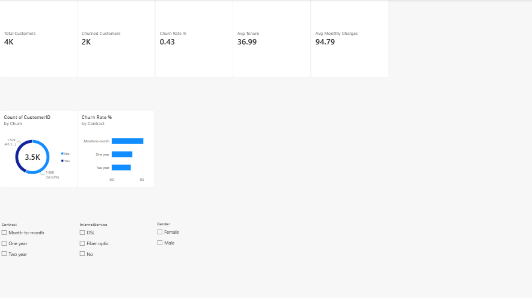
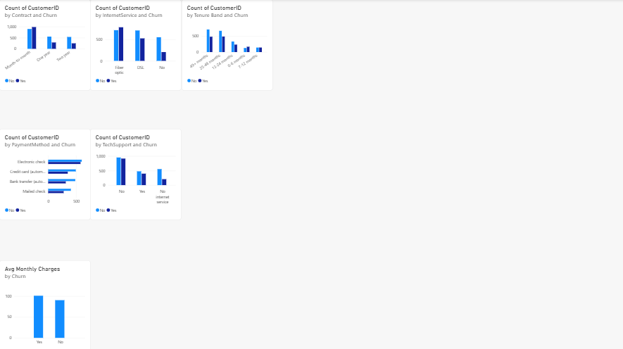
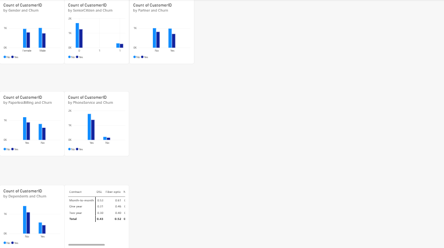
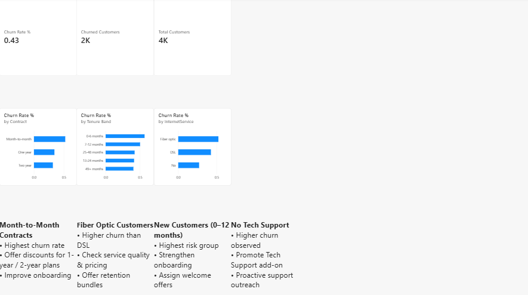

### SQL Analysis
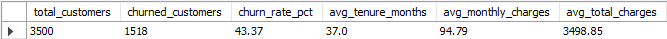
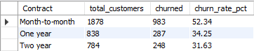
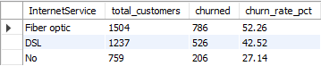
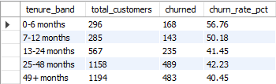
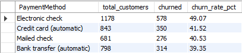
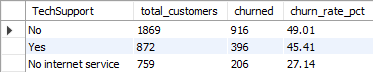

### Python Visualizations
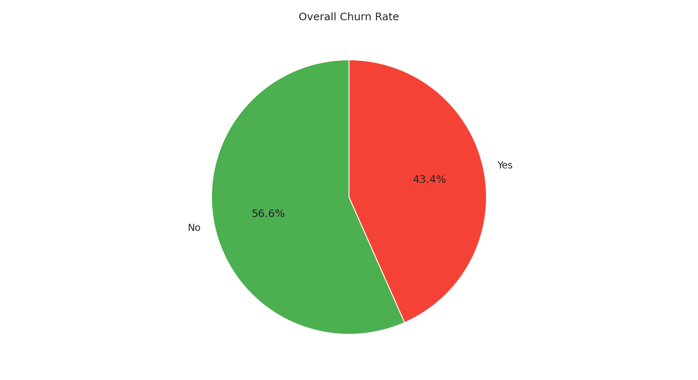
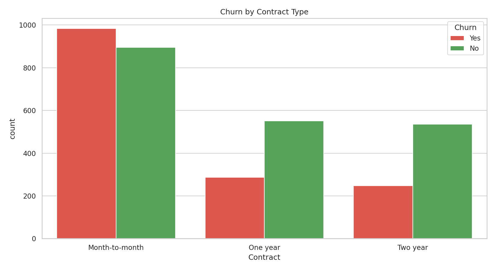
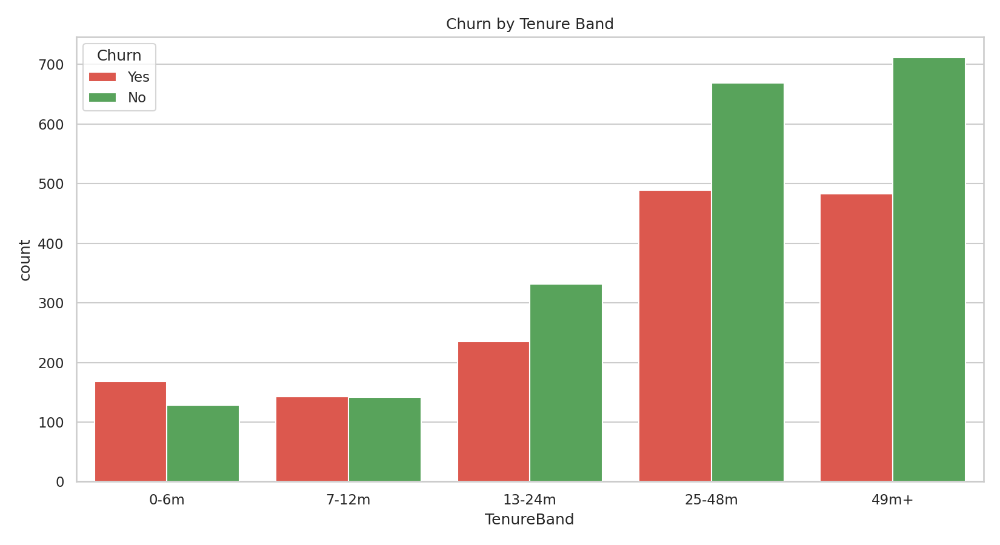
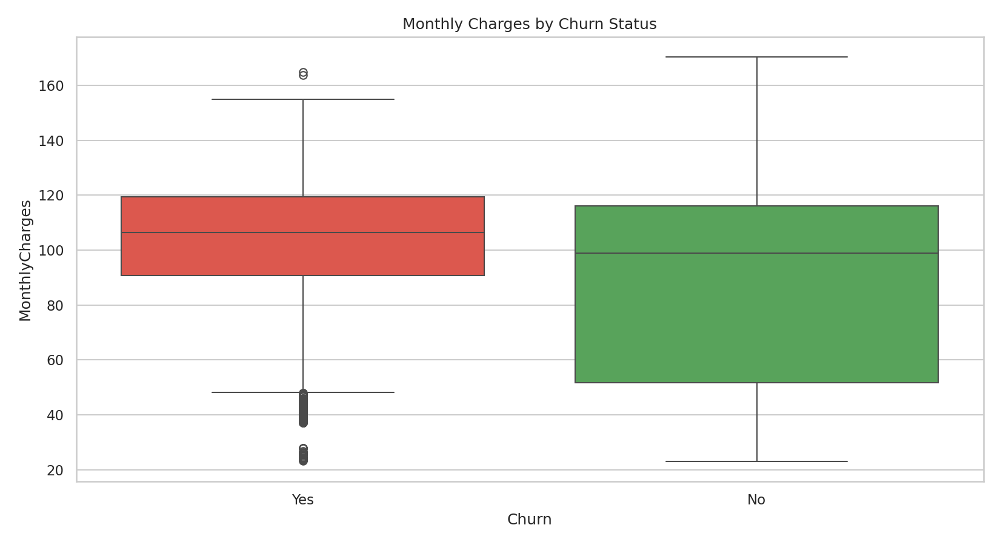
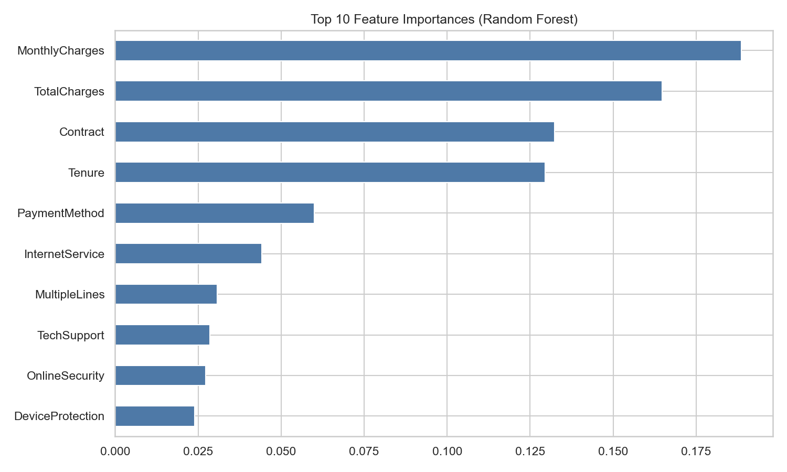
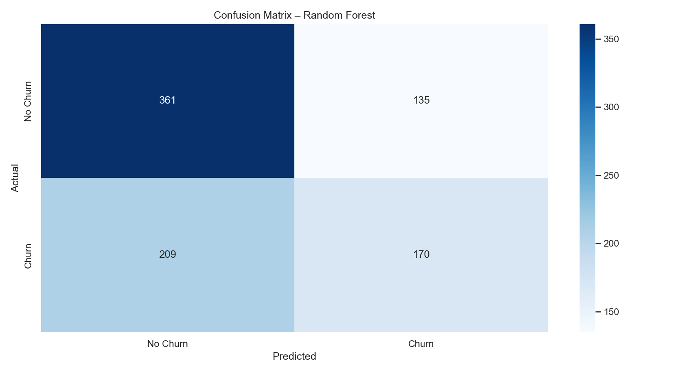

---

## 👤 Author

**Mubeen Salman**  
Aspiring Data Analyst  

- LinkedIn: [https://www.linkedin.com/in/mubeen-salman-459776364/]  
- GitHub: [https://github.com/MuhammadMubeen04]  

---

## 📄 License

This project is for educational and portfolio purposes.
